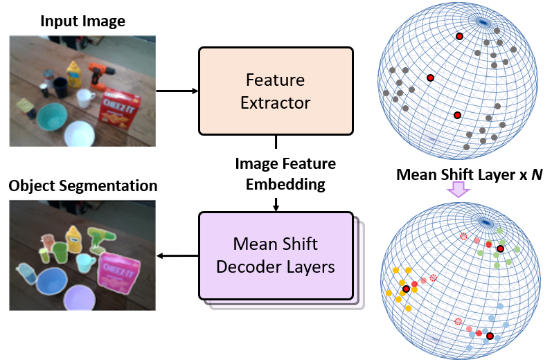
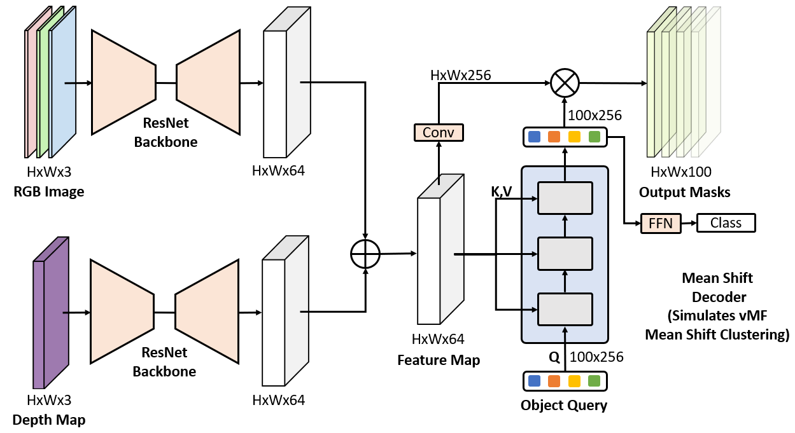
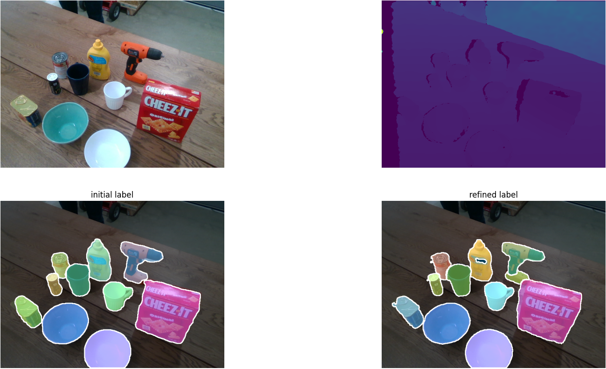
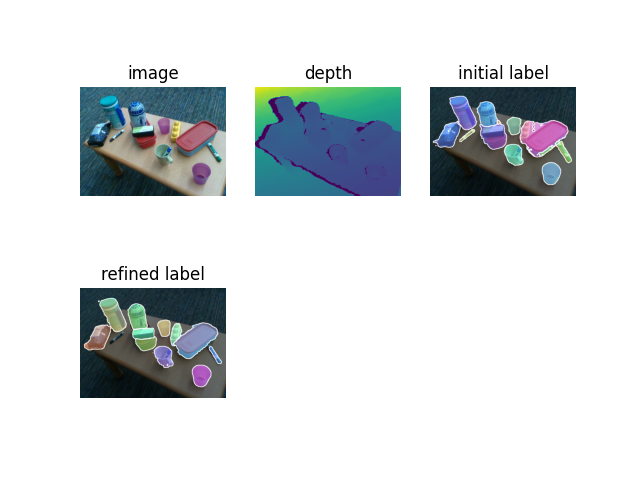

# Unseen Object Instance Segmentation with MSMFormer

This repository includes: Mean Shift Mask Transformer and its finetuned version with long-term robot interaction.

## Mean Shift Mask Transformer for Unseen Object Instance Segmentation
### International Conference on Robotics and Automation (ICRA), 2024.
### Introduction
Segmenting unseen objects is a critical task in many different domains. For example, a robot may need to grasp an unseen object, which means it needs to visually separate this object from the background and/or other objects. Mean shift clustering is a common method in object segmentation tasks. However, the traditional mean shift clustering algorithm is not easily integrated into an end-to-end neural network training pipeline. In this work, we propose the Mean Shift Mask Transformer (MSMFormer), a new transformer architecture that simulates the von Mises-Fisher (vMF) mean shift clustering algorithm, allowing for the joint training and inference of both the feature extractor and the clustering. Its central component is a hypersphere attention mechanism, which updates object queries on a hypersphere. To illustrate the effectiveness of our method, we apply MSMFormer to Unseen Object Instance Segmentation, which yields a new state-of-the-art of 87.3 Boundary F-measure on the real-world Object Clutter Indoor Dataset (OCID).
[arXiv](https://arxiv.org/abs/2211.11679)  [project](https://irvlutd.github.io/MSMFormer/)
<p align="center"></p>

### Mean Shift Mask Transformer Architecture
<p align="center"></p>


### Citation

If you find Mean Shift Mask Transformer useful in your research, please consider citing:

```
@misc{https://doi.org/10.48550/arxiv.2211.11679,
  doi = {10.48550/ARXIV.2211.11679},
  url = {https://arxiv.org/abs/2211.11679},
  author = {Lu, Yangxiao and Chen, Yuqiao and Ruozzi, Nicholas and Xiang, Yu},
  keywords = {Computer Vision and Pattern Recognition (cs.CV), Artificial Intelligence (cs.AI), Machine Learning (cs.LG), Robotics (cs.RO), FOS: Computer and information sciences, FOS: Computer and information sciences},
  title = {Mean Shift Mask Transformer for Unseen Object Instance Segmentation},
  publisher = {arXiv},
  year = {2022},
  copyright = {arXiv.org perpetual, non-exclusive license}
}
```
## Self-Supervised Unseen Object Instance Segmentation via Long-Term Robot Interaction
### In Robotics: Science and Systems (RSS), 2023.
### Introduction
We introduce a novel robotic system for improving unseen object instance segmentation in the real world by leveraging long-term robot interaction with objects. Previous approaches either grasp or push an object and then obtain the segmentation mask of the grasped or pushed object after one action. Instead, our system defers the decision on segmenting objects after a sequence of robot pushing actions. By applying multi-object tracking and video object segmentation on the images collected via robot pushing, our system can generate segmentation masks of all the objects in these images in a self-supervised way. These include images where objects are very close to each other, and segmentation errors usually occur on these images for existing object segmentation networks. We demonstrate the usefulness of our system by fine-tuning segmentation networks trained on synthetic data with real-world data collected by our system. We show that, after fine-tuning, the segmentation accuracy of the networks is significantly improved both in the same domain and across different domains. In addition, we verify that the fine-tuned networks improve top-down robotic grasping of unseen objects in the real world.
[arXiv](https://arxiv.org/abs/2302.03793) [project](https://irvlutd.github.io/SelfSupervisedSegmentation/)
### Citation

If you find the method useful in your research, please consider citing:

```
@misc{https://doi.org/10.48550/arxiv.2302.03793,
  doi = {10.48550/ARXIV.2302.03793},
  url = {https://arxiv.org/abs/2302.03793},
  author = {Lu, Yangxiao and Khargonkar, Ninad and Xu, Zesheng and Averill, Charles and Palanisamy, Kamalesh and Hang, Kaiyu and Guo, Yunhui and Ruozzi, Nicholas and Xiang, Yu},
  keywords = {Robotics (cs.RO), Computer Vision and Pattern Recognition (cs.CV), Machine Learning (cs.LG), FOS: Computer and information sciences, FOS: Computer and information sciences},
  title = {Self-Supervised Unseen Object Instance Segmentation via Long-Term Robot Interaction},
  publisher = {arXiv},
  year = {2023},
  copyright = {Creative Commons Attribution 4.0 International}
}
```
### Required Environment
- Ubuntu 16.04 or above
- PyTorch 0.4.1 or above
- CUDA 9.1 or above

### Install
The code is based on [Detetron2 framework](https://detectron2.readthedocs.io/en/latest/tutorials/getting_started.html).
1. Install PyTorch
2. Install [Detetron2](https://detectron2.readthedocs.io/en/latest/tutorials/install.html)
3. Install other packages

For example, in an anaconda environment:
```Shell
pip install torch==1.10.0+cu111 torchvision==0.11.0+cu111 torchaudio==0.10.0 -f https://download.pytorch.org/whl/torch_stable.html
pip install detectron2 -f https://dl.fbaipublicfiles.com/detectron2/wheels/cu111/torch1.10/index.html
pip install -r /path/to/requirement.txt
```
Some code is from [UCN](https://github.com/IRVLUTD/UnseenObjectClustering) and [Mask2Former](https://github.com/facebookresearch/Mask2Former). 
The main folder is **$ROOT/MSMFormer/meanshiftformer**. The Python classes begin with "pretrained" are used for Unseen Object Instance Segmentation.
The Hypersphere Attention is in [this file](https://github.com/YoungSean/UnseenObjectsWithMeanShift/blob/master/MSMFormer/meanshiftformer/modeling/transformer_decoder/attention_util.py).

If there is an error like *AttributeError: module 'numpy' has no attribute 'bool'*, try to reinstall numpy package as follows:
```shell
python -m pip uninstall numpy
python -m pip install numpy==1.23.1
```

If there is an error like ModuleNotFoundError: No module named 'MultiScaleDeformableAttention', try to compile [MultiScaleDeformableAttention CUDA](https://github.com/facebookresearch/Mask2Former/blob/main/INSTALL.md) op with the following commands:
```shell
cd MSMFormer/meanshiftformer/modeling/pixel_decoder/ops
sh make.sh
```

### Download
- Create a folder $ROOT/data/checkpoints
- Download the [pretrained backbone checkpoints](https://utdallas.app.box.com/s/9vt68miar920hf36egeybfflzvt8c676) from [UCN](https://github.com/IRVLUTD/UnseenObjectClustering). They are *seg_resnet34_8s_embedding_cosine_rgbd_add_sampling_epoch_16.checkpoint.pth* and *seg_resnet34_8s_embedding_cosine_rgbd_add_crop_sampling_epoch_16.checkpoint.pth*. 
Then move the checkpoint files into $ROOT/data/checkpoints. 
- Download our trained checkpoints
  - Weights Trained with TableTop Object Dataset and Config files: [RGBD weights](https://utdallas.box.com/s/e93nx0gj3x38so4o3zj3p9fzo3pvwqgy) and [RGB weights](https://utdallas.box.com/s/4bqiadd1rjb4s7x1qocha5gp9kh91tyj).
  - Weights Trained with UOAIS dataset: [RGB and RGBD weights](https://utdallas.box.com/s/hrxs73d755x1j1zwafpgc9d8unisdyj8). Config files can be found from the above TableTop weight links. You may change the weight path in the config files before inference.
  - After downloading weights, move the checkpoint files into $ROOT/data/checkpoints.
- Download our fine-tuned checkpoints from [here](https://utdallas.box.com/s/vzp8nmalowg4i58y8b9sghv5s7f36xpz) (No login needed). The model is finetuned by [a dataset from robot interaction](https://utdallas.app.box.com/s/yipcemru6qsbw0wj1nsdxq1dw5mjbtiq).

### Training on the Tabletop Object Dataset (TOD)
1. Download the Tabletop Object Dataset (TOD) from [here](https://drive.google.com/uc?export=download&id=1Du309Ye8J7v2c4fFGuyPGjf-C3-623vw) (34G).

2. Create a symlink for the TOD dataset
    ```Shell
    cd $ROOT/data
    ln -s $TOD_DATA tabletop
    ```

3. Training and testing on the TOD dataset
    ```Shell
    cd $ROOT/MSMFormer

    # multi-gpu training, we used 4 GPUs
   python tabletop_train_net_pretrained.py --num-gpus 4

    ```


### Testing on the OCID dataset and the OSD dataset

1. Download the OCID dataset from [here](https://www.acin.tuwien.ac.at/en/vision-for-robotics/software-tools/object-clutter-indoor-dataset/), and create a symbol link:
    ```Shell
    cd $ROOT/data
    ln -s $OCID_dataset OCID
    ```

2. Download the OSD dataset from [here](https://www.acin.tuwien.ac.at/en/vision-for-robotics/software-tools/osd/), and create a symbol link:
    ```Shell
    cd $ROOT/data
    ln -s $OSD_dataset OSD
    ```
3. Test
    ```Shell
    cd $ROOT/lib/fcn
    python test_demo.py
    ```
   Or you can directly run $ROOT/lib/fcn/test_demo.py with IDE like PyCharm.

### Demo
1. For Demo images in $ROOT/data/demo, you can run $ROOT/experiments/scripts/demo_msmformer_rgbd.sh to see the visual results. (* demo_msmformer_rgb.sh is only using RGB information.)
<p align="center"> </p>

2. $ROOT/experiments/scripts/demo_msmformer_*_finetuned.sh files use the fine-tuned weights.

3. An example python script is $ROOT/tools/test_image_with_ms_transformer.py.

   In terminal, run the following command:
   ```shell
   ./tools/test_image_with_ms_transformer.py  \
   --imgdir data/demo   \
   --color *-color.png   \
   --depth *-depth.png \
   --pretrained path/to/first/stage/network/checkpoint \
   --pretrained_crop path/to/second/stage/network/checkpoint \
   --network_cfg path/to/first/stage/network/config/file \
   --network_crop_cfg path/to/second/stage/network/config/file
   ```
   
   An example is shown as follows:
   ```shell
   ./tools/test_image_with_ms_transformer.py  \
   --imgdir data/demo   \
   --color *-color.png   \
   --depth *-depth.png \
   --pretrained data/checkpoints/norm_model_0069999.pth \
   --pretrained_crop data/checkpoints/crop_dec9_model_final.pth \
   --network_cfg MSMFormer/configs/mixture_UCN.yaml  \
   --network_crop_cfg MSMFormer/configs/crop_mixture_UCN.yaml \
   --input_image RGBD_ADD
   ```

### Running with ROS on a real camera for real-world unseen object instance segmentation

- Make sure our pretrained checkpoints are downloaded.

    ```Shell
    # start realsense if you use a realsense camera
    roslaunch realsense2_camera rs_aligned_depth.launch tf_prefix:=measured/camera

    # start rviz
    rosrun rviz rviz -d ./ros/segmentation.rviz

    # run segmentation on a realsense camera, $GPU_ID can be 0, 1, etc.
    ./experiments/scripts/ros_seg_transformer_test_segmentation_realsense.sh $GPU_ID
    
    # run segmentation on a Fetch camera, $GPU_ID can be 0, 1, etc.
    ./experiments/scripts/ros_seg_transformer_test_segmentation_fetch.sh $GPU_ID
    
    ```
    
Our example running on a Fetch robot:
<p align="center"></p>    
